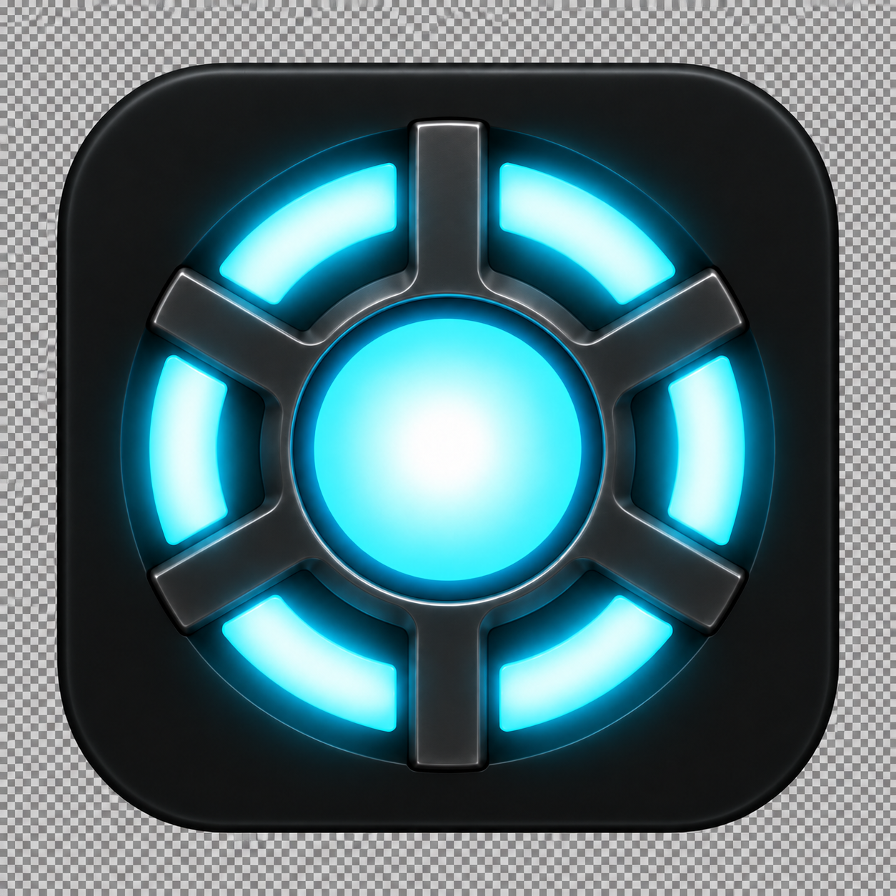
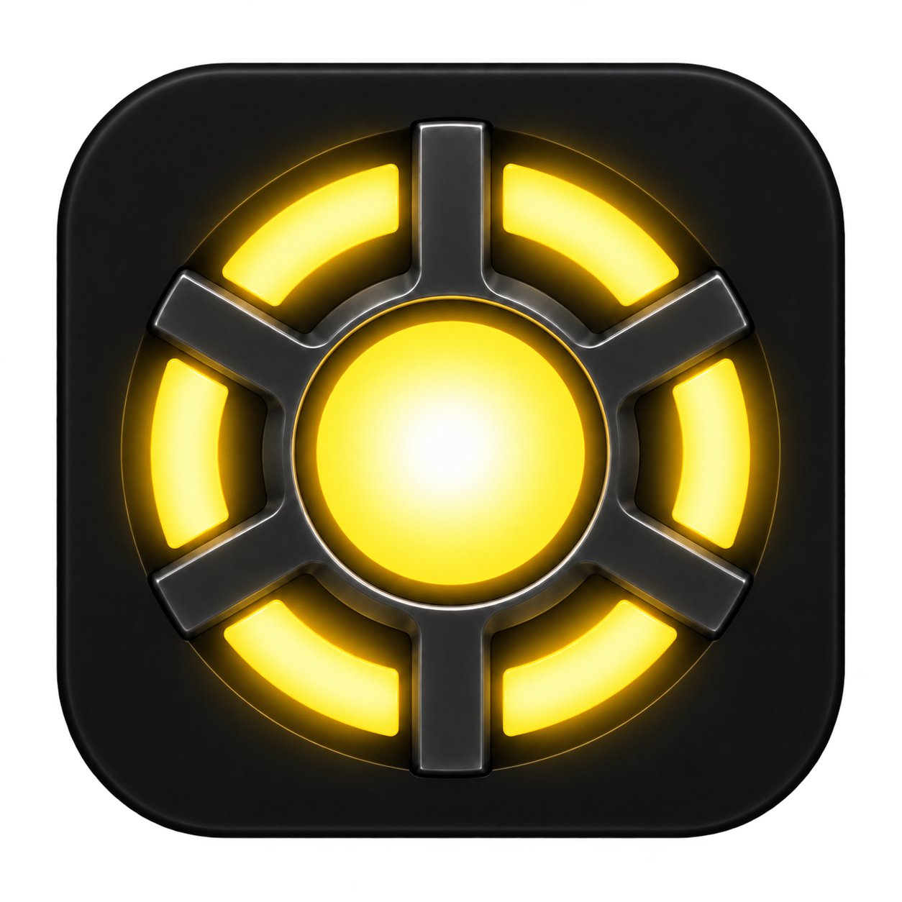

# Dark-background icon revision — preview

Status: approved on 2026-09-14 and applied to the project PNG and ICNS assets, replacing the previous artwork. Existing signed packages remain the earlier build. Prepared with the built-in image editor.

Question: does an evenly dark backplate and subdued upper support lighting preserve a solid appearance at small icon sizes?

Requested changes: remove the backplate's top-to-bottom lighting gradient, match its upper half to the existing deep-black lower half, and reduce the upper support bends' broad white highlights to match the lower supports. Preserve the existing geometry and uniform radial luminous core. Production remains cyan; development remains yellow with no badge.

## Production edit prompt

Use case: precise-object-edit. Edit the existing Agentshed macOS app icon; preserve its exact design, proportions, six spokes, six cyan luminous segments and centered uniformly radial cyan-white glowing solid core. Image 1 is the clean existing icon (edit target); Image 2 is an annotated screenshot indicating the problem areas only. Remove all annotation rectangles in output. Make ONLY these lighting/material corrections: (1) the rounded-square backplate must be uniformly very dark near-black, matching the existing lower half's deep black across the entire plate, with NO top-to-bottom gradient, NO overhead spotlight, NO bright upper rim or gray wash; retain only a subtle dark edge to communicate the silhouette. (2) The metal supports in the upper-left and upper-right red boxes must match the lower corresponding supports in muted dark gunmetal tone and subdued edge reflections. Remove the overly bright white/silver ribbons along their upper inner bends: the metal must read as solid dark material at 32px, not as glowing hollow cutouts. Keep subtle 3D bevels consistent all around. Make the top vertical spoke similarly subdued and consistent with the bottom spoke. Preserve cyan light segments and the original perfectly isotropic smooth radial glow of the solid center unchanged, including their soft local cyan bloom. No global directional light. Keep the same straight-on composition, full rounded-square silhouette, original margins, no typography, no badge, no extra elements. Output ONE standalone production cyan icon, high resolution square PNG, with genuine alpha transparency outside the rounded-square silhouette; do not paint checkerboard pixels.

## Development edit prompt

Use case: precise-object-edit. Create the matching DEVELOPMENT color variant of Image 1, the already corrected Agentshed app icon. Image 1 is the edit target and exact source of geometry, deep black background and muted metal lighting; Image 2 is ONLY a reference for the approved golden-yellow light color. Change ONLY the luminous cyan coloring of Image 1's solid round central core, all six perimeter light segments, and their local glow to the golden yellow of Image 2. Preserve Image 1's uniformly very dark near-black rounded-square backplate, no top-to-bottom brightness gradient, no overhead illumination, no broad bright rim. Preserve Image 1's subdued dark gunmetal six-spoke supports, especially the upper-left and upper-right inner bends, which must have no white/silver bright ribbons and must remain as dark and solid as the lower matching supports. Keep the original solid core's smooth even radial white-to-yellow glow identical in every direction; no holes, rings, rays or directional hotspots. Exact same silhouette, proportions, straight-on placement and margins as Image 1. No dot, no dev badge, no text, no markings. Output one standalone square high-resolution yellow development icon. Transparent alpha outside the rounded-square silhouette, no painted checkerboard.
