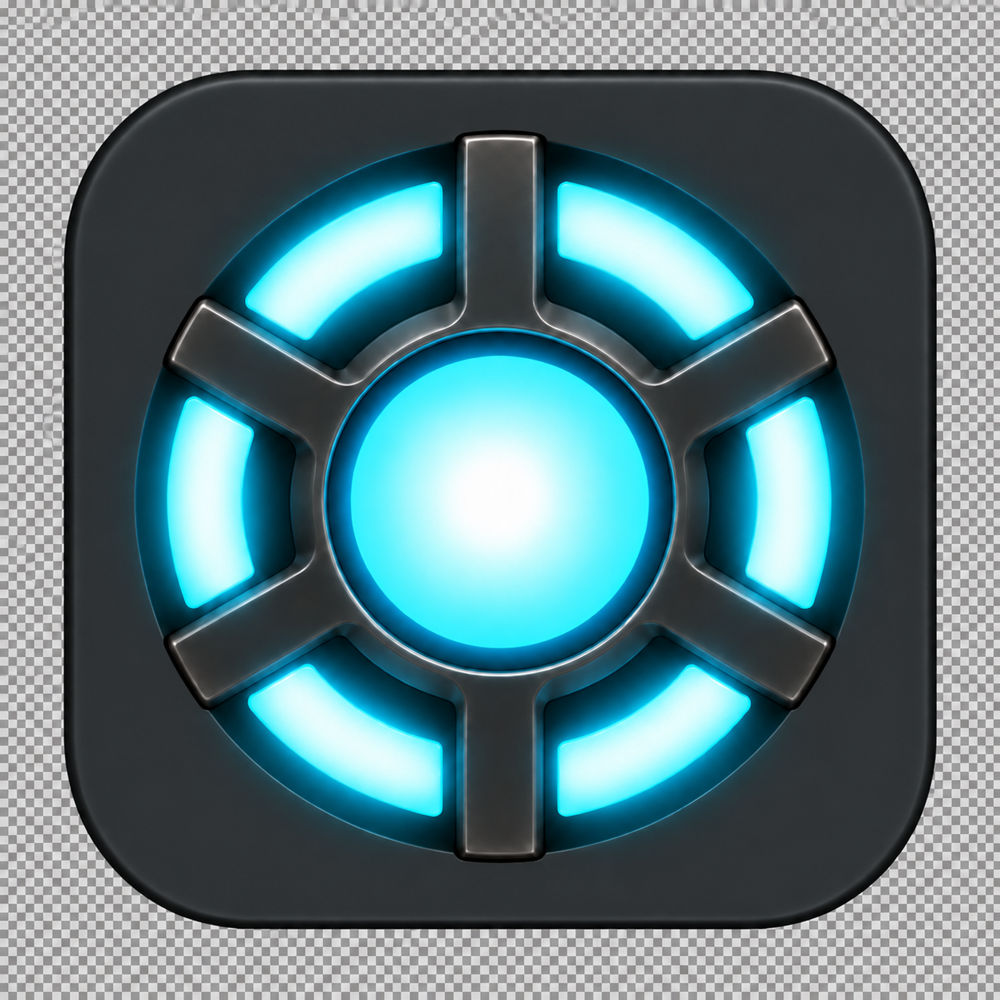
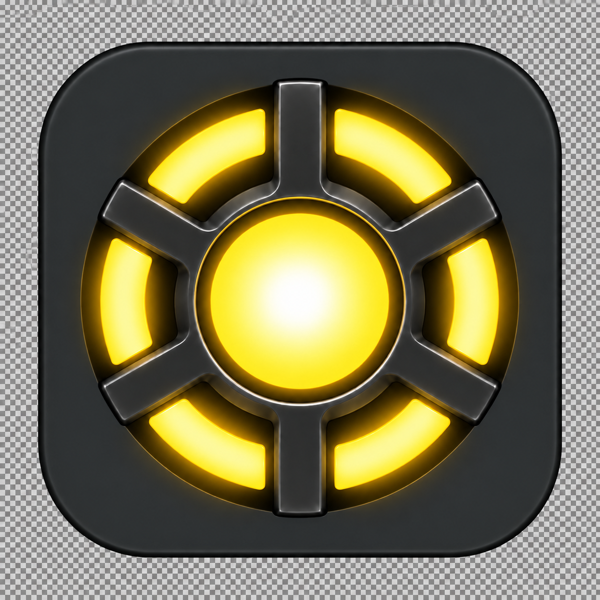

# Slightly lighter graphite background — preview

Status: approved and applied to the project PNG/ICNS assets, replacing v2. The user requested skipping review-code, review-tests and features-catalog for this revision.

Question: does a modest lift from near-black to deep graphite gray make the backplate readable without restoring directional lighting or excessive metal highlights?

The edit targets only the backplate base tone. Existing geometry, subdued metal supports, cyan/yellow distinction and radial core glow are retained. Created with the built-in image editor; prompts below record the requested constraints, not pixel-identity guarantees.

## Production prompt

Use case: precise-object-edit. Edit ONLY the rounded-square backplate/casing color of this existing Agentshed production app icon. The user finds the present background too black. Raise the large near-black flat backplate surfaces slightly to a restrained deep graphite gray, approximately sRGB #25282B, a modest lift rather than a light gray. The plate should now be visibly dark gray even at small Dock icon size. Keep brightness spatially even across top and bottom: NO vertical gradient, NO overhead spotlight, NO bright silver rim, NO directional illumination. Preserve the already-approved muted dark-gunmetal support highlights, especially the subdued top-left/top-right inner bends: DO NOT brighten supports. Preserve all six cyan luminous segments and the filled circular central core with perfectly even radial cyan-white glow EXACTLY as the input. Preserve geometry, proportions, six-spoke layout, framing, corner shape, local cyan bloom, and material depth. Change only the broad backplate base tone, not overall exposure, not central reactor brightness or saturation. No text, no badges. One standalone square cyan production icon PNG. Transparent alpha exterior outside the rounded-square silhouette; no painted checkerboard.

## Development prompt

Use case: precise-object-edit. Image 1 is the existing yellow DEVELOPMENT icon to edit. Image 2 is the new cyan production reference ONLY for the slightly lighter deep graphite gray rounded-square backplate. Change ONLY Image 1's broad near-black backplate/casing base color to match Image 2's restrained deep graphite gray, approximately #25282B. Apply the same modest lift evenly across upper and lower backplate; no overhead spotlight, no vertical gradient, no bright upper rim. Preserve the complete yellow reactor of Image 1 EXACTLY: golden-yellow six perimeter light segments and filled central core, perfectly even radial white-to-yellow glow, original subdued dark gunmetal supports and their already corrected upper bends. Do NOT brighten the supports or reactor and do not introduce hollow-looking white metal highlights. Preserve all framing, silhouette, corner radius, local bloom, proportions and geometry. Do not recolor to cyan. No badge, no dot, no words. Output one square standalone development icon PNG with original genuine transparent alpha exterior retained, no checkerboard.
